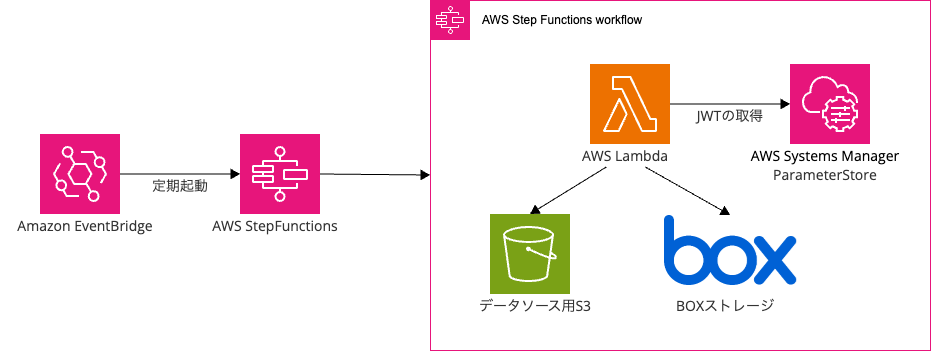

# Box to S3 Data Sync

Boxの特定フォルダーから指定条件に一致するファイルをS3にダウンロードし同期します。
Amazon Bedrockナレッジベースへのデータ連携も可能です。

## 概要

このプロジェクトはAWS CDKを使用して以下のリソースをデプロイします：

1. Box API接続用のLambda関数
2. データ同期処理を実行するStep Functions
3. 必要なIAMロールとポリシー

## セットアップと実行

1. リポジトリのクローンと依存関係のインストール
   ```bash
   git clone https://github.com/sakai-classmethod/box-to-s3-data-sync
   cd box-to-s3-data-sync
   npm ci
   ```

2. Boxアプリケーションの作成とJSONのダウンロード
   - [Box JWT認証の設定ガイド](https://ja.developer.box.com/guides/authentication/jwt/jwt-setup/)にしたがって、Boxアプリケーションを作成します
   - サーバー認証（JWT）を選択し、設定JSONファイルをダウンロードします
   - ダウンロードしたJSONファイルを`box_config.json`として保存します
> [!IMPORTANT]
>  開発者コンソールの「構成」タブで、アプリケーションアクセスを「App + Enterpriseアクセス」に設定してください。
>  作成したBoxアプリケーションを同期対象のBoxフォルダーにコラボレーターとして招待し、ビューアー権限を付与してください。[コラボレーターの招待方法](https://support.box.com/hc/ja/articles/360043696854-%E3%82%B3%E3%83%A9%E3%83%9C%E3%83%AC%E3%83%BC%E3%82%BF%E3%81%AE%E6%8B%9B%E5%BE%85)や[権限レベルの詳細](https://support.box.com/hc/ja/articles/360044196413-%E3%82%B3%E3%83%A9%E3%83%9C%E3%83%AC%E3%83%BC%E3%82%BF%E3%81%AE%E6%A8%A9%E9%99%90%E3%83%AC%E3%83%99%E3%83%AB%E3%81%AB%E3%81%A4%E3%81%84%E3%81%A6)については、Boxのドキュメントを参照してください。

3. Box JWT設定をAWS Systems Managerパラメータストアにアップロード
   ```bash
   aws ssm put-parameter \
     --name "/box/jwt" \
     --type "SecureString" \
     --value file://./box_config.json \
     --overwrite \
     --no-cli-pager \
     --region ap-northeast-1
   ```

4. `cdk.json`の設定
   `cdk.json`ファイルの`context`セクション内に異なる環境のパラメーターを設定します：
   
   ```json
   {
     "context": {
       "": {
         "bucketName": "your-data-source-bucket-name",
         "ssmParamName": "/box/jwt",
         "s3Prefix": "docs",
         "boxFolderId": "your-box-folder-id",
         "maxFileSizeMB": 50,
         "knowledgeBaseId": "your-knowledge-base-id",
         "dataSourceId": "your-data-source-id",
         "env": {
           "account": "123456789012",
           "region": "ap-northeast-1"
         }
       },
       "dev": {
         "bucketName": "your-dev-bucket-name",
         "ssmParamName": "/box/jwt",
         "s3Prefix": "docs",
         "boxFolderId": "your-box-folder-id",
         "maxFileSizeMB": 50,
         "knowledgeBaseId": "your-knowledge-base-id",
         "dataSourceId": "your-data-source-id",
         "env": {
           "account": "123456789012",
           "region": "ap-northeast-1"
         }
       }
     }
   }
   ```
   
   各パラメーターの説明：
   - `bucketName`: 同期されたファイルを保存するS3バケット名（ナレッジベースのデータソース）
   - `ssmParamName`: Box JWT設定が保存されているSSMパラメーター名（デフォルト値のままでもOK）
   - `s3Prefix`: S3バケット内のフォルダプレフィックス
   - `boxFolderId`: 同期するBoxのフォルダーID（[確認方法](https://ja.developer.box.com/platform/appendix/locating-values/#%E3%82%B3%E3%83%B3%E3%83%84id)）
   - `maxFileSizeMB`: ダウンロード可能な最大ファイルサイズ（MB単位）。初期値50MBは[Amazon Bedrockナレッジベースの前提条件](https://docs.aws.amazon.com/ja_jp/bedrock/latest/userguide/knowledge-base-ds.html)に合わせています
   - `knowledgeBaseId`: Amazon Bedrockナレッジベースの識別子
   - `dataSourceId`: ナレッジベース内のデータソース識別子
   - `env`: AWSアカウントとリージョンの設定

5. デプロイ
   環境を指定してデプロイします。環境を指定しない場合はデフォルト設定（空の文字列）が使用されます：
   
   ```bash
   # デフォルト環境へデプロイ
   npm run cdk:deploy
   
   # 開発環境へデプロイ
   npm run cdk:deploy:dev
   ```
   
   または、package.jsonに定義されたスクリプトを使用します：
   
   ```bash
   # デフォルト環境へデプロイ
   npm run cdk:deploy
   
   # 開発環境へデプロイ
   npm run cdk:deploy:dev
   ```

6. 実行方法
   
   ### AWS マネジメントコンソールから手動実行
   - AWS Step Functionsコンソールにアクセス
   - `BoxToS3SyncStateMachine` を選択
   - 「実行」をクリックし、パラメーターを入力して実行
   
   ```json
   {
     "hoursAgo": 24,
     "filePrefix": "sample",
     "KnowledgeBaseId": "XXXXXXXX",
     "DataSourceId": "XXXXXXXX"
   }
   ```
   
   ### EventBridgeによる自動実行
   CDKデプロイ時に、毎日日本時間AM1:00に実行されるEventBridgeルールが自動的に作成されます。
   
   - ルール名: `daily-box-to-s3-sync`
   - 実行時間: 毎日日本時間AM1:00（UTC 15:00）
   - 入力パラメーター:
     ```json
     {
       "hoursAgo": 24,
       "filePrefix": "",
       "KnowledgeBaseId": "設定済みKnowledgeBaseId",
       "DataSourceId": "設定済みDataSourceId"
     }
     ```
   
   EventBridgeルールのスケジュールや入力パラメーターを変更する場合は、CDKコードを修正するかマネジメントコーソールから直接変更してください。

## アーキテクチャ



## 動作の仕組み

このソリューションは以下のワークフローに従います：

1. Step Functionsのステートマシンが全体のプロセスを調整
2. Lambda関数がSSMパラメータストアに保存されたJWT認証を使用してBox APIに接続
3. 指定された条件（時間範囲、ファイル名プレフィックス）に基づいてファイルをフィルタリング
4. 条件に一致するファイルをBoxからダウンロードしS3にアップロード
5. データをAmazon Bedrockナレッジベースと同期

## Step Functionsのワークフロー

1. **ExecuteBoxSync**: Box to S3同期処理（Lambda関数を呼び出し）
2. **StartIngestion**: Bedrockナレッジベースのデータソース同期開始

## 実行パラメーター

以下のパラメーターでStep Functionsを実行できます：

```json
{
  "hoursAgo": 24,
  "filePrefix": "sample",
  "KnowledgeBaseId": "XXXXXXXX",
  "DataSourceId": "XXXXXXXX"
}
```

`filePrefix`を配列で指定する場合：

```json
{
  "hoursAgo": 24,
  "filePrefix": ["sample", "test"],
  "KnowledgeBaseId": "XXXXXXXX",
  "DataSourceId": "XXXXXXXX"
}
```

- **hoursAgo**: 何時間前までの更新ファイルを対象とするか（省略時は全ファイル）
- **filePrefix**: ファイル名のプレフィックス（文字列または配列で指定可能）
- **KnowledgeBaseId**: Amazon BedrockナレッジベースのID（**必須**、Bedrockナレッジベース連携を行う場合）
- **DataSourceId**: ナレッジベースのデータソースID（**必須**、Bedrockナレッジベース連携を行う場合）
